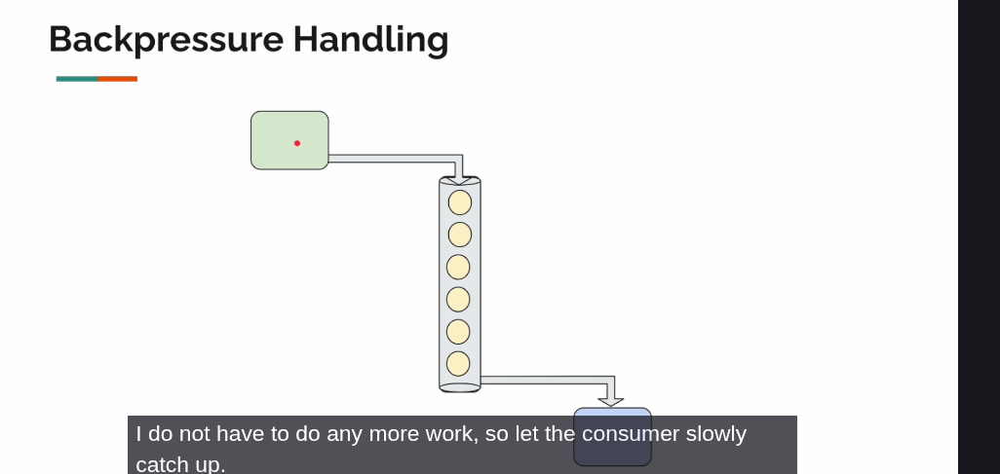
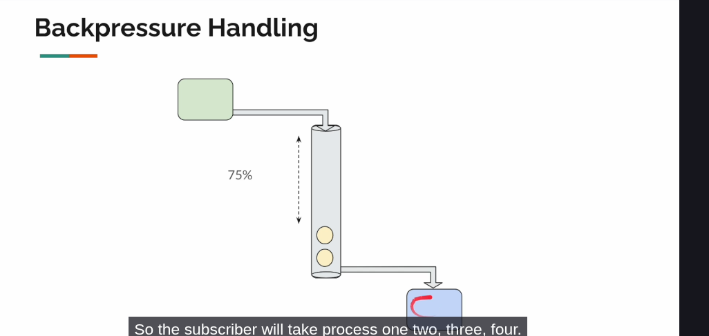

How backpressure works
By default publisher publish 256 elements to the queue. 

If subscriber too slow to consume data it will wait subscriber to consume 75% of the queue. After that it will start too produce again
